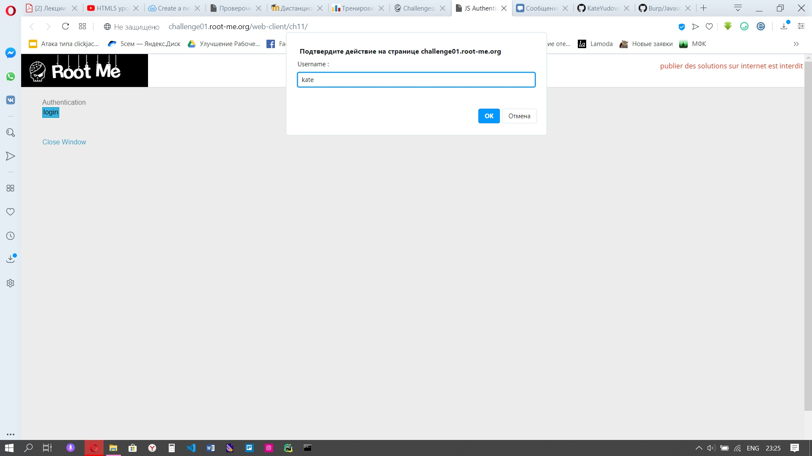
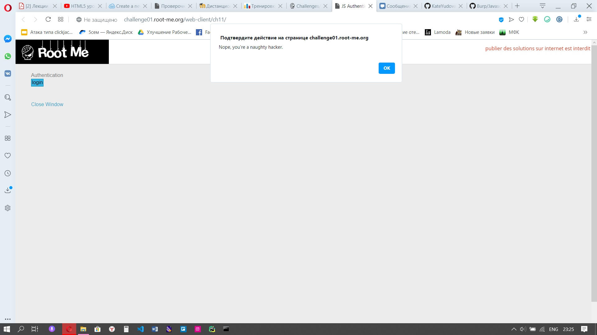
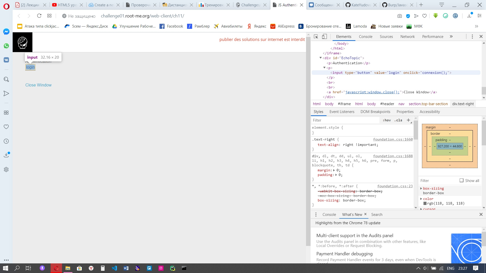
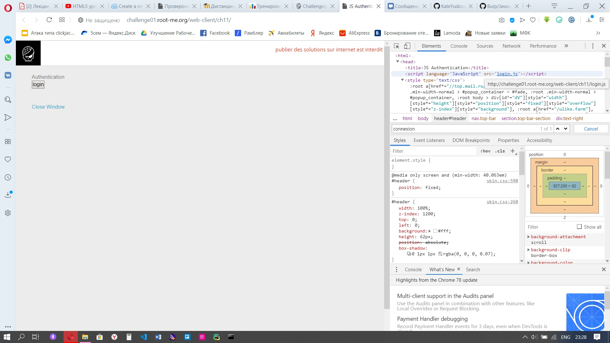
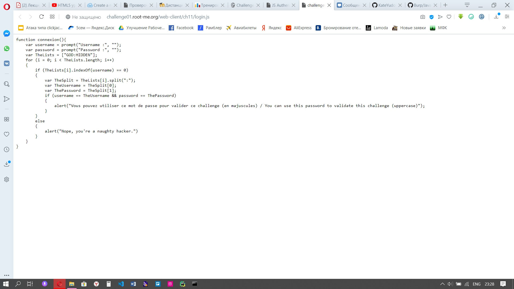

1) Переходим по адресу /web-client/ch11/
2) Нажимаем login, пытаемся ввести пароль и логин, но у нас ничего не получается

3) Открываем код страницы и замечаем функцию connexion(), которая вызывается при клике, она лежит в Authentication

4) А для Authentication существует JS Authentication, в котором лежит скрипт, переходя по ссылке, мы можем увидеть нашу функцию-обработчик

5) Смотрим на скрипт и пытаемся понять что же там происходит. Получается, что из "GOD:HIDDEN" "GOD" идет в имя пользователя, а "HIDDEN" - в строку с паролем. То есть, наш пароль "HIDDEN"
