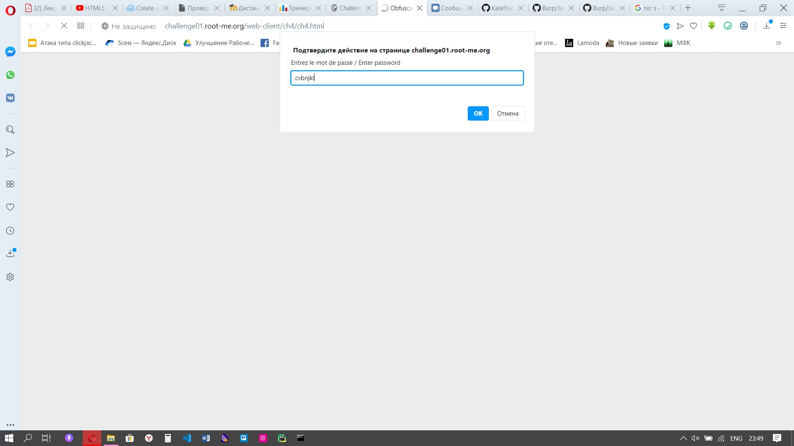

1) Переходим по адресу /web-client/ch4/ch4.html
2) Пытаемся ввести пароль, но ничего не получается

3) Открываем код страницы, находим скрипт и пытаемся понять, что же нам нужно

4) Строку pass надо раскодировать как URL, т.к. там есть метод unescape() и получаем "cpasbiendurpassword"

