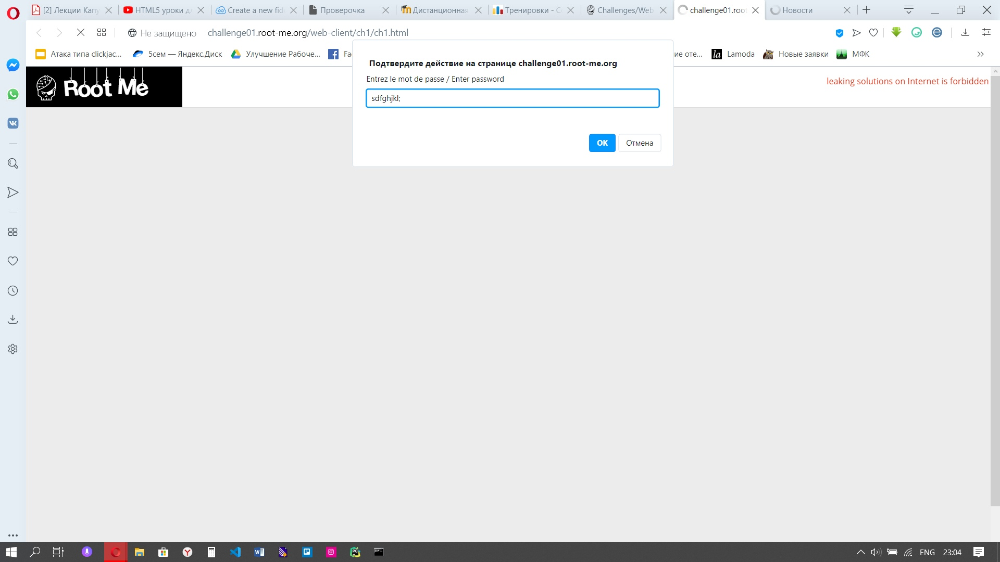
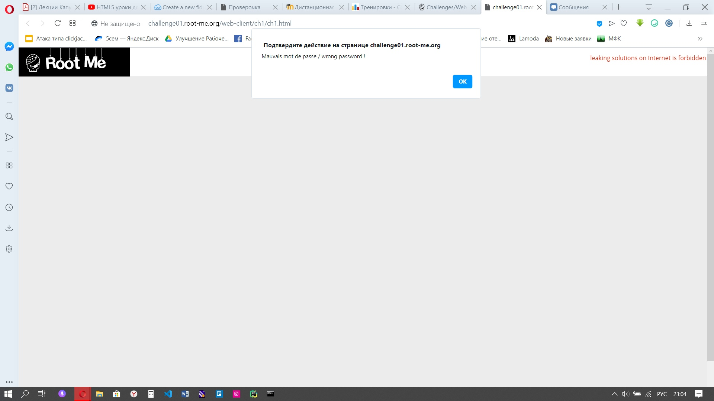
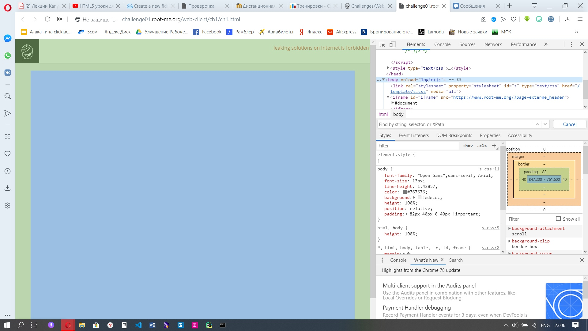
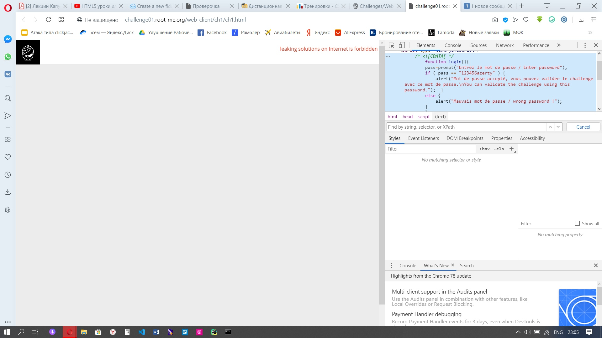

1) Переходим по адресу /web-client/ch1
2) Появляется поле для ввода пароля, мы вводим пароль, а он оказывается неправильным, печалька (

3) Смотрим код страницы и замечаем, что у нас вызывается 

4) Находим скрипт с этой функцией и замечаем пароль, который нам нужен : 

